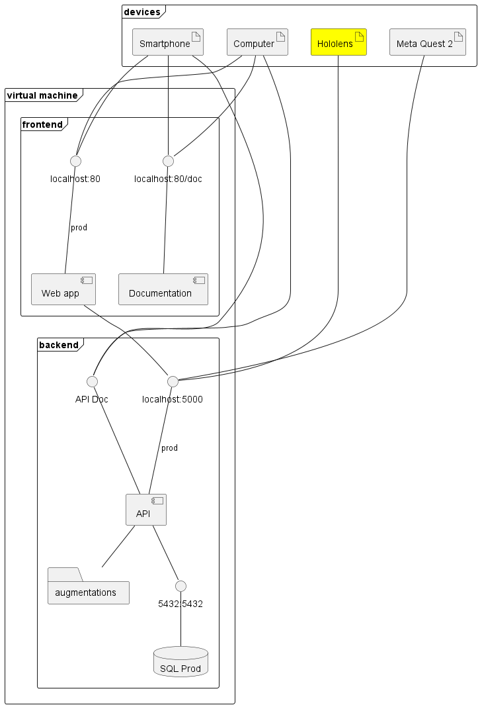

<h2 align="center">HELP - AR</h2>
<h3 align="center">Hybrid Extended Learning Platform - AR client</h3>

    
    
    

 Join us on: 

## Description
Hybrid Extended Learning Platform is a software package that aims to ease the creation of XR content for intructional usage. The principle is to use a unique web interface to design instructional activities with augmentations and access it throught AR ou VR client. 

## Component Description
This repository contains the source code for the web interface of the authoring tool and its documentation. It is part of the HELP porject. To properly work, it requires also the [HELP API](https://github.com/ERPI-UL/HELP-API).

## Ackowledgment
The development of the tool that initiated this work was funded by the Grand Est region.

## Compenent set-up

Make sure to add this package to the Unity project package : https://github.com/AimXR/AimXRToolkit.git